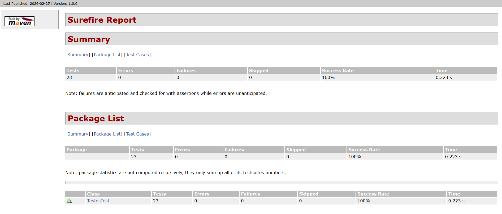
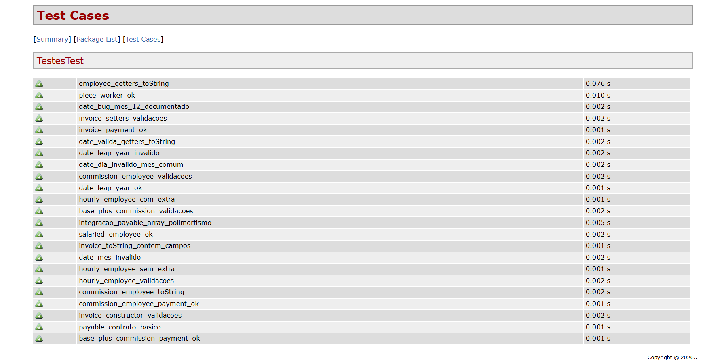

## 📌 Sobre o projeto

Projeto em **Java (POO)** que calcula pagamentos de forma **polimórfica** usando a interface `Payable`.

### Principais componentes
- **Payable**: contrato com `getPaymentAmount()`
- **Employee (abstrata)**: base para funcionários
  - `SalariedEmployee`, `HourlyEmployee`, `CommissionEmployee`,
    `BasePlusCommissionEmployee`, `PieceWorker`
- **Invoice**: fatura que também implementa `Payable`
- **Date**: representa data de nascimento

### O que o projeto demonstra
- **Herança, sobrescrita e polimorfismo**
- Processamento unificado de objetos `Payable[]`
- **Testes automatizados com JUnit 5** (inclui teste de integração simples)
- Build/execução com **Maven** e ambiente isolado via **Docker**


## 🧱 1. Estrutura do Projeto

A estrutura **obrigatória** para o Maven reconhecer corretamente o projeto é:

```text
projeto-java/
│
├── pom.xml
├── Dockerfile
├── docker-compose.yml
│
├── src/
│   ├── main/
│   │   └── java/
│   │       └── (classes do sistema)
│   │
│   └── test/
│       └── java/
│           └── TestesTest.java
│
└── target/ (gerado automaticamente pelo Maven)

⚠️ Atenção: o Maven só reconhece testes em src/test/java.
```
## 🐳 2. Pré-requisitos

Você precisa ter instalado apenas:
- Docker Desktop

## 🚀 3. Construindo o Projeto

Na raiz do projeto (onde está o docker-compose.yml), execute:
```bash
docker compose up --build --abort-on-container-exit
```
#### O que esse comando faz:

- 🔨 Builda a imagem Docker

- 📦 Instala dependências do Maven

- 🧪 Executa mvn test

- 📁 Gera a pasta target/

- 📊 Cria os relatórios dos testes

## 📁 4. Onde ficam os resultados?

Após rodar os testes, o Maven cria:
```text
target/
├── classes/
├── test-classes/
├── surefire-reports/
│   ├── TEST-TestesTest.xml
│   └── TestesTest.txt
└── site/
```
### Arquivo XML padrão:

- target/surefire-reports/TEST-TestesTest.xml

## 🌐 5. Gerando o Relatório HTML Bonito

Para gerar o relatório em formato visual HTML:

Execute:
```bash
docker compose run --rm tests mvn test surefire-report:report
```
#### O que acontece:

- 🧪 Roda os testes novamente

- 📝 Lê os resultados do Surefire

- 📊 Gera relatório HTML

#### O arquivo será criado em:

- target/site/surefire-report.html


## 🖥️ 6. Abrindo o Relatório
- Rode o comando que abrirá o site no navegador: 
```bash
start target/site/surefire-report.html
```

## 🖼️ 7. Resultado do relatório no navegador: 



## 📊 Exemplo de Resultado Esperado
#### No relatório HTML você verá:

- Nome da classe de teste

- Quantidade de testes

- Tempo de execução

- Falhas (se houver)

- Erros (se houver)

- Lista individual de cada método testado

#### Exemplo:
```text
Tests run: 23
Failures: 0
Errors: 0
Skipped: 0
```
## 🧹 8. Limpando o Projeto

Para limpar os artefatos gerados:
```bash
docker compose run --rm tests mvn clean
```
#### Isso remove a pasta: target/

## 🔄 9. Fluxo Completo Resumido

Passo a passo do zero até o relatório:

### 1️⃣ Build e rodar testes
```bash
docker compose up --build --abort-on-container-exit
```
### 2️⃣ Gerar relatório HTML
```bash
docker compose run --rm tests mvn test surefire-report:report
```
### 3️⃣ Abrir relatório
```bash
start target/site/surefire-report.html
```


## 🏆 Status Atual do Projeto
#### ✅ 23 testes executados
#### ✅ 0 falhas
#### ✅ 0 erros
#### ✅ Relatório HTML funcional
